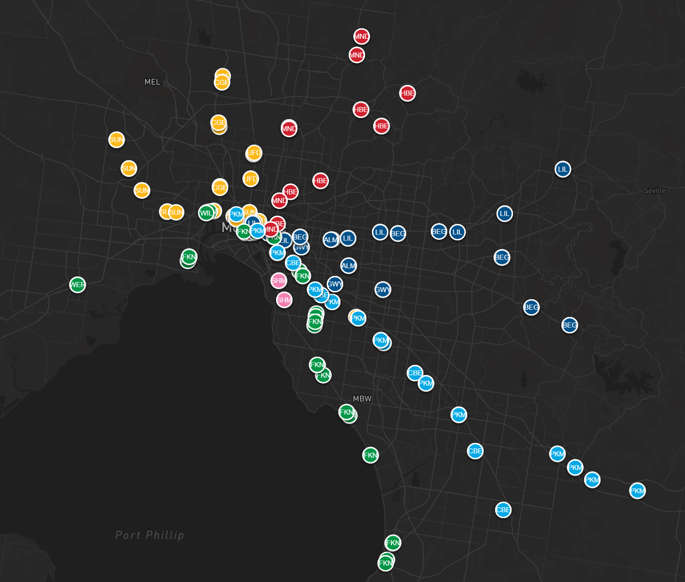

# PTV Vehicle Tracker 

A web application that displays live locations of Public Transport Victoria (PTV) vehicles (trains, trams, buses) on an intereactive map. Users can view history of vehicle locations with a animated playback feature.

## Architecture
- Collector (Python)
  Continuously pulls vehicle location data from PTV API and writes to Supabase
- Database (Supabase_
  Stores vehicle locatino data for up to 24 huors
- Web App (Next.js)
  Provides API routes for querying data and a frontend UI for visualisation

## Tech Stack
- **Next.js** with API Routes
- **Typescript** for type safety
- **Railway** for collector deployment
- **Vercel** for app deployment

```
apps/
├── collector/               # Collects data continuously from PTV API and stores in supabase
│   └── src
│       ├── main.py          # Entry point for collector
│       ├── ptv_client.py    # Collect data from PTV API, can function indepently
│       ├── db.py            # Write operations to supabase
│       └── config.py        # Collector configuration
└── web/
    ├── app
    │   └── api              # Backend API routes to fetch data from supabase
    ├── components
    │   └── PTVTrainTracker  # Frontend UI to display data
    └── lib                  # Contains type declarations
```
